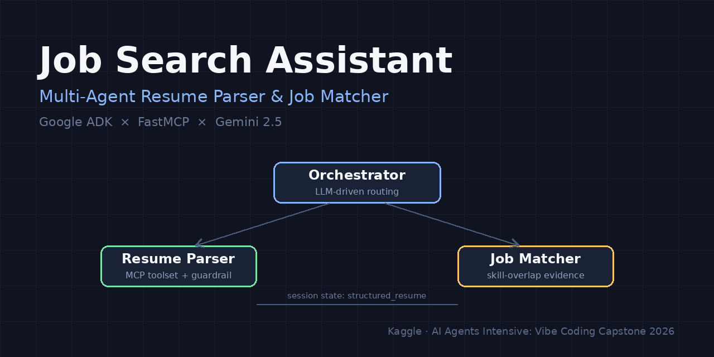
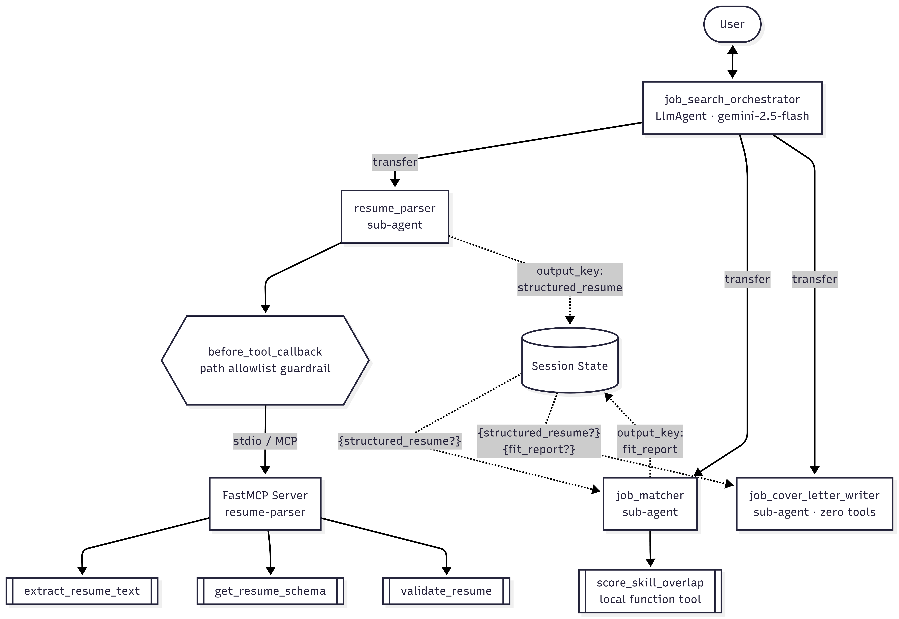

# Job Search Assistant 🎯



**A multi-agent system that parses resumes, evaluates job fit, and drafts tailored cover letters — built with Google ADK + FastMCP.**

*Capstone project for Kaggle's [AI Agents Intensive: Vibe Coding](https://www.kaggle.com/competitions/vibecoding-agents-capstone-project) course with Google — Concierge Agents track.*

---

## The Problem

Job seekers repeat the same tedious loop for every application: re-reading their own resume, manually comparing it against a job description, deciding which skills to emphasize, then writing yet another cover letter from scratch. The information is all *there* — it's the extraction, structuring, comparison, and re-telling that eats hours. This is exactly the kind of multi-step, tool-dependent workflow that a single LLM prompt handles poorly but an agent system handles well.

## The Solution

A conversational assistant with three specialist agents behind a coordinator:

1. **Parse** — drop in a resume file path (PDF/DOCX/TXT) and get validated, schema-conformant JSON.
2. **Match** — paste any job description and get a fit report grounded in deterministic skill-overlap evidence, not hallucinated matches.
3. **Write** — request a cover letter drafted from the parsed resume and the fit analysis, citing only real achievements and handling gaps honestly.

## Architecture



**Data flow:** the orchestrator's LLM routes each request to a specialist by reading sub-agent descriptions (LLM-driven delegation — no hard-coded routing). The parser and matcher each write their result to session state via `output_key`; downstream agents read those keys back through instruction templating. The three specialists never communicate directly — **session state is the data bus**. Adding the cover-letter writer required zero changes to the existing agents: it simply subscribes to two state keys that were already being published.

## Course Concepts Demonstrated

| Key Concept | Where |
|---|---|
| **Multi-agent system (ADK)** | `job-agent/job_search_agent/agent.py` — orchestrator + 3 sub-agents, LLM-driven delegation, state-based data passing |
| **MCP Server** | `resume-mcp-server/server.py` — FastMCP server with 3 tools + 1 resource, consumed via `MCPToolset` over stdio |
| **Security features** | Two layers: agent-side path allowlist callback (`job_search_agent/security.py`) + server-side extension allowlist & size cap (`resume-mcp-server/extractors.py`) |
| **Deployability** | See demo video — deployment path via `adk deploy` discussed with architecture |

## Design Decisions

- **The MCP server contains zero LLM calls.** It exposes only deterministic capabilities (extract / schema / validate); the *intelligence* — turning raw text into structured JSON — lives in the agent. The server needs no API keys, tools stay unit-testable, and the LLM does the reasoning. That's the point of an agent.
- **Validation as a self-correction loop.** `validate_resume` returns field-addressed errors (`contact.email: value is not a valid email address`) designed for an LLM to map back onto its own output and repair it — the agent gets up to 3 attempts.
- **Tolerant tools, strict schema.** Tools called by LLMs follow Postel's law: `validate_resume` strips markdown fences and trailing commentary before parsing (LLMs habitually add both), while the Pydantic schema itself stays strict.
- **MCP tool vs. local tool vs. no tool.** Reusable-across-systems capabilities (file parsing) live in the MCP server; agent-private logic (`score_skill_overlap`) stays a plain Python function tool; and the cover-letter writer has **zero tools by design** — writing is a pure language task, and not every agent needs tools. Tool restraint is an architecture decision too.
- **Deterministic evidence before LLM judgment.** The matcher must call `score_skill_overlap` first, then layer qualitative analysis (transferable skills, gaps) on top of verifiable numbers — anchoring the report and reducing hallucinated "matches".

## Security

Defense in depth — each layer covers the other's blind spot:

| Layer | Guard | Blocks |
|---|---|---|
| Agent (`security.py`) | `before_tool_callback` directory allowlist | Path traversal, e.g. a prompt-injected resume asking the agent to read `~/.ssh/id_rsa` — short-circuited **before** the tool call leaves the agent |
| MCP server (`extractors.py`) | Extension **allowlist** (not blocklist) + 10 MB size cap | Untested file types, resource-exhaustion via huge files |
| Secrets | `.env` + `.gitignore` | API keys never enter the repo; `samples/` (real resumes = personal data) is ignored too |

## Project Structure

```
kaggle/
├── resume-mcp-server/        # FastMCP server (no LLM, no API keys)
│   ├── server.py             # MCP tools + schema resource
│   ├── schemas.py            # Pydantic models — single source of truth
│   ├── extractors.py         # PDF/DOCX/TXT extraction + security checks
│   └── test_server.py        # in-memory MCP client tests
└── job-agent/
    └── job_search_agent/     # ADK multi-agent package
        ├── agent.py          # root orchestrator
        ├── parser.py         # resume parser sub-agent (MCP toolset)
        ├── matcher.py        # job matcher sub-agent (function tool)
        ├── writer.py         # cover letter writer sub-agent (zero tools)
        └── security.py       # path allowlist callback
```

## Setup

Requires **Python 3.11+** and a free [Google AI Studio API key](https://aistudio.google.com/apikey).

```bash
git clone https://github.com/wesleyhuan/job_search_assistant.git kaggle
cd kaggle

# one shared venv for server + agent (they must use the same interpreter)
python -m venv .venv
# Windows:
.venv\Scripts\activate
# macOS/Linux:
# source .venv/bin/activate

python -m pip install -r resume-mcp-server/requirements.txt
python -m pip install google-adk

# configure the API key
copy job-agent\job_search_agent\.env.example job-agent\job_search_agent\.env
# edit .env: GOOGLE_API_KEY=your_key_here

# verify the MCP server standalone (6 tests should pass)
python resume-mcp-server/test_server.py

# launch
cd job-agent
adk web
```

Open `http://localhost:8000`, select **job_search_agent**, then try the full journey:

1. `Hello, what can you do for me?` — orchestrator introduces its capabilities
2. `Parse <absolute path to a resume file>` — watch the Events tab: transfer → `get_resume_schema` → `extract_resume_text` → `validate_resume`
3. Paste any job description — transfer → `score_skill_overlap` → four-part fit report
4. `Write a cover letter for this job` — transfer → cover letter drafted from the resume + fit report already in session state
5. `Parse C:\Windows\System32\drivers\etc\hosts` — see `BLOCKED_BY_POLICY` from the security guardrail

> The agents mirror the user's language: write to them in English, Traditional Chinese, Japanese, etc., and each agent replies in that same language. The example prompts above are shown in English for readability.

## Known Limitations & Future Work

- **No OCR** — scanned/image-only PDFs are rejected with a clear message rather than mis-parsed.
- **Literal skill matching** — `score_skill_overlap` is exact-match by design (deterministic evidence); semantic matching is delegated to the LLM layer. An embedding-based scorer is a natural next step.
- **Single-resume session** — parsing a new resume overwrites the previous one in session state.
- **Context-cache cost** — agent transfers and state templating both rewrite the system instruction, breaking Gemini's context cache alignment. Acceptable at interactive scale; the production optimization would be keeping instructions static and letting agents fetch state through tools instead.

## License

MIT
